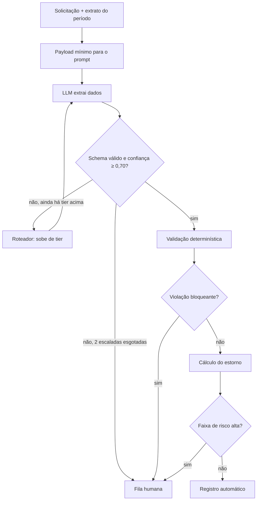

# voided - automação de triagem de contestação de transação

Pipeline agêntico para o processo de contestação (chargeback) de transações de cartão:
coleta da solicitação, validação de elegibilidade, cálculo do estorno e registro do caso.

> Desafio técnico. Os dados são sintéticos; nenhuma API externa é obrigatória para executar.

## Como rodar

```bash
mamba env create -f environment.yml
mamba activate voided
python run.py --mock    # execução completa, sem chave de API
pytest -q                           # testes das regras, do cálculo e do pipeline
jupyter lab notebooks/analise.ipynb # métricas e decisões
```

O modo `--mock` reproduz respostas gravadas de uma execução real (`data/llm_cache.jsonl`),
então os números do notebook são reproduzíveis bit a bit. Cada resposta é gravada pela chave
`(id_caso, versão do prompt, tier)`. O mock nunca inventa resposta: chave ausente é erro, e
uma resposta gravada com um modelo diferente do atual em `config/modelos.toml` também.

- **Log:** cada caso processado vira uma linha `EventoExecucao` em `outputs/eventos.jsonl`
  (append; troque com `--out`).
- **Subconjunto:** `--split dev|eval` e `--limit N` escolhem quais casos rodam.
- **Versão anterior do prompt:** `--prompt extract_v1` reproduz a versão anterior do prompt
  de extração, desde que ela esteja no cache.

### Refazer os dados do zero

Os passos abaixo chamam APIs e precisam de chaves no `.env`:
- `ANTHROPIC_API_KEY`, para os tiers médio e grande;
- `OPENAI_API_KEY`, para o gerador de textos e o tier pequeno. Nesta entrega os dois usam a
  Gemini API pela interface compatível com OpenAI, então essa variável recebe a chave do
  Google.

Os modelos e campos usados pelo código ficam em `config/modelos.toml`.

```bash
python scripts/gen_specs.py            # data/case_specs.jsonl: extrato + gabarito de cada caso
python scripts/build_golden.py         # data/golden_set.jsonl: rótulo esperado de cada caso
python scripts/gen_texts.py            # data/synthetic_cases.jsonl: texto do cliente
python run.py --record --tier todos    # data/llm_cache.jsonl: extração de cada caso em cada tier
```

`--record` não passa pelo roteador: extrai todos os casos no tier pedido e só grava o cache.
Com `--tier todos`, o cache cobre qualquer caminho que o roteador possa tomar. Por isso dá para
comparar políticas de roteamento e versões de prompt offline, sem chamada nova.

---

## 0. Premissa: onde o LLM entra e onde não entra

Das quatro etapas do processo, só uma é de fato ambiguidade linguística. Interpretar a queixa do cliente, que chega em texto livre por canais diferentes, é trabalho de modelo de linguagem. Decidir se o prazo de contestação expirou é um `if`, e calcular o valor do estorno é aritmética sobre o extrato. Usar um LLM nessas duas últimas trocaria uma regra auditável e testável por uma amostra de uma distribuição, sem ganho algum.

Por isso o LLM aparece em um único ponto do pipeline, a extração estruturada na etapa de coleta, e as etapas de validação e cálculo são Python determinístico com testes. Modelos de linguagem também foram usados fora do pipeline, para redigir os textos sintéticos dos clientes (`scripts/gen_texts.py`), sempre a partir de um gabarito construído antes em Python.

| Etapa | Natureza | Implementação |
|---|---|---|
| Coleta | I/O + texto livre | dados sintéticos em JSONL + LLM para extração (`src/steps/extract.py`) |
| Validação | regra de negócio | Python determinístico (`src/steps/validate.py`) |
| Cálculo | aritmética | Python determinístico (`src/steps/compute.py`) |
| Registro | I/O + redação | template (`src/steps/register.py`); nesta versão nenhum LLM redige a resposta |

## 1. Fluxo do agente



A máquina de estados fica em `src/orchestrator.py` (extração -> validação -> cálculo ->
registro), e cada estado é uma função que devolve o próximo. Toda decisão sobre o tier do modelo ou de
escalada vem de `src/router.py` e fica gravada em `EventoExecucao.rotas`, com o motivo em
texto. Os status finais são:
- `automatico`: resolvido no primeiro tier;
- `escalado_modelo`: resolvido depois de subir de tier;
- `escalado_humano`;
- `erro`: qualquer exceção não prevista, com o estado em que ocorreu. Nenhuma exceção deveria escapar
  de `processar_caso`.


### 1.1 Extração (LLM)

O que o modelo recebe:
- **Vai no prompt:** o texto do cliente, o canal, a data e, de cada transação, id, data,
  valor, estabelecimento e canal.
- **Fica de fora:** o id do cliente, o histórico de contestações, `mcc`, `pais` e
  `ja_estornada`. Esse último poderia levar o modelo a julgar elegibilidade, que é
  trabalho da validação.
- **CPF:** um texto com CPF cru é recusado já na entrada, pelo schema da solicitação.

O modelo retorna uma `ExtracaoContestacao` com os campos:
- motivo;
- ids citados;
- valor alegado;
- se o cliente afirma não ter autorizado;
- se tentou contato com o estabelecimento;
- resumo;
- confiança de 0 a 1;
- justificativa.

**Resposta fora do schema**: Qualquer desvio do schema (Pydantic extra="forbid") é falha de schema. Isso inclui JSON inválido, resposta cortada por limite de tokens, campo a mais e texto acima do limite. A falha nunca é consertada por heurística, e o custo de chamadas falhas é registrado.

### 1.2 Validação (determinística)
O código cruza o que o modelo propôs com os dados da base. Cada regra gera uma `Violacao` bloqueante ou de alerta.
A tabela abaixo lista as regras e a severidade de cada uma:

| Regra | Severidade |
|---|---|
| Nenhuma transação citada | bloqueante |
| Id citado que não existe no período (o modelo não consegue inventar transação) | bloqueante |
| Transação com mais de 120 dias | bloqueante |
| Transação já estornada | bloqueante |
| Duplicidade sem outra cobrança de mesmo estabelecimento e valor em até 24h | bloqueante |
| `valor_divergente` sem valor alegado, ou com valor devido ≥ cobrado | bloqueante |
| Motivo `indeterminado` | bloqueante |
| Valor alegado diferente da soma das transações (o estorno sai da base, não do relato) | alerta |
| Compra presencial em alegação de não reconhecimento ou fraude | alerta |
| Mais de 3 contestações em 12 meses | alerta |
| Transação com data posterior à solicitação | alerta |


### Integração com ferramentas/APIs

Em produção, o pipeline seria dependente de ferramenta interna da instituição financeira que buscasse as transações em banco de dados.
Para testes da implementação, casos sintéticos foram gerados simulando a atuação do buscador de transações.
As chaves de API ficam só no .env, que não é versionado (modelo em .env.example). Em produção viriam de um cofre de segredos.


## 2. Uso de modelos: quando SLM, quando escalar

O critério para uma tarefa ficar no tier pequeno é ter saída fechada e schema rígido, alto volume, latência relevante e dado sensível, que idealmente não sai do perímetro. 
Extração de campos a partir de um texto curto, com o conjunto de motivos fixo, satisfaz todos. O critério para escalar é linguagem ambígua ou narrativa longa, conflito entre o relato e os dados do extrato, categoria rara e valor alto o bastante para justificar o custo. A medição da seção 3 mostra que, neste processo, quase nada satisfaz o segundo critério: os três tiers ficam entre 87% e 90% de extração completa correta, e a diferença se concentra no `texto_vago`, onde nenhum tier resolve.
O caso sempre começa no tier pequeno (Gemma), e a escada é pequeno -> médio (Sonnet) -> grande (Opus).

- Se a saída veio fora do schema ou com confiança < 0,70, sobe um degrau e extrai de novo.
- Se o problema persiste depois de 2 escaladas (os três tiers já tentados), o caso encerra como escalado_humano.
- Se a confiança ficou ≥ 0,70, a extração é aceita e o caso segue para a validação.

| Tarefa | Implementação | Escala quando |
|---|---|---|
| Extração: motivo, transações citadas, valor alegado, afirmações do cliente | uma chamada estruturada, prompt `src/prompts/extract_v2.md`, começa no tier pequeno | saída fora do schema ou confiança < 0,70; sobe para médio e depois grande; esgotado, fila humana |
| Casamento relato × extrato | dentro da mesma extração (o modelo recebe o extrato); a conferência é feita na validação, sem LLM | não escala |
| Redação da resposta ao cliente | template, sem LLM | não escala |

**Restrição de perímetro:** no desenho, o caminho de alto volume roda um modelo aberto hospedado
internamente, e só casos escalados, com o payload mínimo, alcançam uma API externa.

Nesta entrega não havia GPU disponível. O tier pequeno usa o Gemma 4 31B, um modelo aberto,
pela Gemini API, e por isso `config/modelos.toml` marca `perimetro = "externo"`. O mesmo
modelo poderia rodar dentro do perímetro sem mudar código, só a configuração do tier.


**Separação entre gerador e extrator:** o modelo que escreve os textos sintéticos não pode ser
da mesma família de nenhum tier de extração. `src/config.py` valida isso ao carregar a
configuração, pelo nome do modelo: nome idêntico sempre falha, e mesma família falha a menos
que `permitir_mesma_familia = true`. O motivo é que um texto escrito no estilo do próprio
extrator infla a acurácia medida.

## 3. Estratégia de roteamento

A política fica em `src/router.py`, uma função pura:
1. **Entrada:** toda extração começa no tier pequeno.
2. **Escalada:** saída fora do schema ou confiança abaixo de `LIMIAR_CONFIANCA = 0.70` sobe
   um tier. O limiar é provisório até calibrar a confiança.
3. **Limite:** depois de `MAX_ESCALADAS = 2` subidas, o caso vai para a fila humana.
4. **Depois do cálculo:** faixa de risco alta vai para humano.

Uma resposta que nem chega a ser JSON válido também conta como fora do schema: texto solto,
resposta cortada no limite de tokens ou, na Anthropic, resposta sem a tool esperada. Ela é
gravada no cache com o texto bruto e segue o mesmo caminho.

Preços consultados em 2026-09-13 (`data_consulta` em `config/modelos.toml`):

| Tier | Modelo | US$/M entrada | US$/M saída |
|---|---|---|---|
| pequeno | `gemma-4-31b-it` (Gemini API) | 0,00* | 0,00* |
| médio | `claude-sonnet-5` | 2,00 | 10,00 |
| grande | `claude-opus-5` | 5,00 | 25,00 |
\* O Gemma só existe no nível gratuito da Gemini API. Hospedado internamente, o custo seria de
infraestrutura (GPU), não por token.

O custo efetivo por política está na simulação contrafactual abaixo: US$ 4,21 por mil casos na política atual, contra US$ 33,93 em tudo-grande.
### Simulação contrafactual sobre o cache (extract_v2, 120 casos, sem chamada nova)

Gabarito: 46 de 120 casos deveriam sair automáticos.

| política | decisão correta | automatizado | automação indevida | humano desnecessário | subiu de tier | resgatado pela escalada | erro | US$ por caso | US$ por 1.000 casos |
|---|---|---|---|---|---|---|---|---|---|
| tudo-pequeno | 117 (98%) | 46 (38%) | 2 (R$ 324.77) | 1 | 0 (0%) | 0 | 0 | 0.0000 | 0.00 |
| tudo-grande | 118 (98%) | 44 (37%) | 0 (R$ 0.00) | 2 | 0 (0%) | 0 | 0 | 0.0339 | 33.93 |
| política atual | 117 (98%) | 46 (38%) | 2 (R$ 324.77) | 1 | 11 (9%) | 0 | 0 | 0.0042 | 4.21 |

- tudo-pequeno: automação indevida CASO-0006 (texto_vago), estornou R$ 267.45, gabarito R$ 50.16
- tudo-pequeno: automação indevida CASO-0076 (texto_vago), estornou R$ 57.32, gabarito fila humana
- tudo-pequeno: humano desnecessário CASO-0081 (texto_vago), bloqueio sem_transacao_citada
- tudo-grande: humano desnecessário CASO-0006 (texto_vago), bloqueio sem_transacao_citada
- tudo-grande: humano desnecessário CASO-0081 (texto_vago), bloqueio sem_transacao_citada
- política atual: automação indevida CASO-0006 (texto_vago), estornou R$ 267.45, gabarito R$ 50.16
- política atual: automação indevida CASO-0076 (texto_vago), estornou R$ 57.32, gabarito fila humana
- política atual: humano desnecessário CASO-0081 (texto_vago), bloqueio sem_transacao_citada

A comparação contrafactual sobre o cache mostra que a política implementada não se justifica pelos dados: ela toma as mesmas 117 decisões corretas de 120 que o tier pequeno sozinho, incluindo as mesmas duas automações indevidas em texto_vago (R$ 324,77), e paga US$ 4,21 por mil casos por 11 escaladas que não resgatam nenhum caso --- dez delas são indeterminado, que terminariam na fila humana de qualquer forma. Rodar tudo no tier grande elimina as duas automações indevidas por US$ 33,93 por mil casos. A conclusão de desenho é que o limiar de confiança não é critério válido de escalada neste pipeline, e a política seguinte deve escalar por sinais verificáveis em código (id citado ausente do extrato, valor sem correspondência, motivo incompatível com os dados), não por autoavaliação do modelo. Duas ressalvas: o custo do tier pequeno está registrado como zero, e o extract_v2 foi escrito olhando estes mesmos 120 casos, então tanto o custo quanto a acurácia do pequeno saem otimistas.

## 4. Preparação de dados para fine-tuning
- Fase 1: prompt versionado + few-shot + saída estruturada, coletando log;
- Dataset gerado a partir do log: casos escalados e corrigidos por humano são pares rotulados.
  Hoje o `EventoExecucao` guarda a extração validada, e o llm_cache.jsonl guarda a
  resposta bruta de cada tier por (id_caso, versão do prompt, tier);
- Destilação do tier grande para o pequeno. O llm_cache.jsonl guarda a extração de cada caso em cada tier, o que permite isolar os casos em que o tier grande acerta o gabarito e o pequeno erra. Esses pares (entrada do prompt, extração do tier grande) formam o dataset de destilação: o modelo pequeno é ajustado para reproduzir a saída do grande, reduzindo a taxa de escalada sem trocar o modelo de produção. O limite é que o aluno herda os erros e os vieses do professor, então o critério de aceite continua sendo o conjunto dourado, não a concordância com o tier grande.

## 5. Métricas
| Métrica | Valor |
|---|---|
| Acurácia (extração completa, tier pequeno) | 87% |
| Decisão final correta | 117 de 120 (98%) |
| Taxa de automação | 38% (46 de 120) |
| Falso automatizado | 2 casos, R$ 324,77 |
| Custo por execução | US$ 0,0042 |
| Latência LLM por caso p50/p95 | 6,8 s / 17,7 s |

**Qualidade**
- Concordância com o gabarito, por etapa e por campo extraído
- Calibração da confiança (Brier score, diagrama de confiabilidade)
- **Taxa de falso automatizado**: passou sem revisão e estava errado <- a métrica de risco

**Operação**
- Taxa de automação (% fechado sem humano)
- Taxa de escalada, por motivo (extração esgotada, violação bloqueante, faixa alta)
- Taxa de falha de schema, por tier
- Latência p50/p95

**Custo**
- Custo por execução, quebrado por tier
- Custo por caso automatizado com sucesso (o denominador honesto)

### Resultados medidos

#### Concordância com o gabarito (extract_v2, 120 casos)

| campo | pequeno | medio | grande |
|---|---|---|---|
| motivo | 100% | 97% | 100% |
| ids | 92% | 92% | 91% |
| valor | 97% | 99% | 100% |
| nao_autorizou | 100% | 100% | 100% |
| contato | 97% | 98% | 99% |
| completa | 87% | 87% | 90% |
| fora_do_schema | 0% | 0% | 0% |

#### Tier pequeno, por dificuldade

| dificuldade | n | motivo | ids | valor | nao_autorizou | contato | completa |
|---|---|---|---|---|---|---|---|
| texto_vago | 14 | 100% | 36% | 100% | 100% | 93% | 36% |
| relato_contraditorio | 19 | 100% | 100% | 95% | 100% | 95% | 89% |
| nenhuma | 52 | 100% | 100% | 94% | 100% | 98% | 92% |
| multiplas_transacoes | 16 | 100% | 100% | 100% | 100% | 94% | 94% |
| mistura_dois_assuntos | 5 | 100% | 100% | 100% | 100% | 100% | 100% |
| valor_nao_bate | 14 | 100% | 100% | 100% | 100% | 100% | 100% |

#### Tier medio, por dificuldade

| dificuldade | n | motivo | ids | valor | nao_autorizou | contato | completa |
|---|---|---|---|---|---|---|---|
| texto_vago | 14 | 93% | 29% | 100% | 100% | 100% | 29% |
| relato_contraditorio | 19 | 95% | 100% | 100% | 100% | 95% | 89% |
| valor_nao_bate | 14 | 93% | 100% | 100% | 100% | 100% | 93% |
| multiplas_transacoes | 16 | 94% | 100% | 100% | 100% | 100% | 94% |
| nenhuma | 52 | 100% | 100% | 98% | 100% | 98% | 96% |
| mistura_dois_assuntos | 5 | 100% | 100% | 100% | 100% | 100% | 100% |

#### Tier grande, por dificuldade

| dificuldade | n | motivo | ids | valor | nao_autorizou | contato | completa |
|---|---|---|---|---|---|---|---|
| texto_vago | 14 | 100% | 21% | 100% | 100% | 100% | 21% |
| relato_contraditorio | 19 | 100% | 100% | 100% | 100% | 95% | 95% |
| multiplas_transacoes | 16 | 100% | 100% | 100% | 100% | 100% | 100% |
| mistura_dois_assuntos | 5 | 100% | 100% | 100% | 100% | 100% | 100% |
| nenhuma | 52 | 100% | 100% | 100% | 100% | 100% | 100% |
| valor_nao_bate | 14 | 100% | 100% | 100% | 100% | 100% | 100% |

#### Calibração da confiança (evento: extração completa correta)

| tier | n | confiança média | acerto | Brier | Brier referência | acerto com conf ≥ 0.7 | acerto com conf < 0.7 |
|---|---|---|---|---|---|---|---|
| pequeno | 120 | 0.94 | 87% | 0.127 | 0.116 | 87% | 82% |
| medio | 120 | 0.82 | 87% | 0.099 | 0.116 | 93% | 55% |
| grande | 120 | 0.88 | 90% | 0.092 | 0.090 | 90% | 90% |

#### Diagrama de confiabilidade, em tabela

| tier | faixa | n | conf_media | acerto |
|---|---|---|---|---|
| grande | 0.50-0.69 | 10 | 0.50 | 90% |
| grande | 0.70-0.79 | 4 | 0.72 | 50% |
| grande | 0.80-0.89 | 10 | 0.83 | 60% |
| grande | >=0.90 | 96 | 0.93 | 95% |
| medio | <0.50 | 10 | 0.39 | 60% |
| medio | 0.50-0.69 | 10 | 0.56 | 50% |
| medio | 0.70-0.79 | 14 | 0.74 | 79% |
| medio | 0.80-0.89 | 26 | 0.85 | 96% |
| medio | >=0.90 | 60 | 0.94 | 95% |
| pequeno | 0.50-0.69 | 11 | 0.50 | 82% |
| pequeno | 0.70-0.79 | 1 | 0.70 | 0% |
| pequeno | 0.80-0.89 | 1 | 0.80 | 100% |
| pequeno | >=0.90 | 107 | 0.99 | 88% |


## 6. Validação contra o processo manual

### Conjunto dourado

Em produção, o conjunto dourado seria formado por casos históricos já decididos por analistas, estratificados para incluir os raros e não só os fáceis. Nesta entrega não há histórico real: o gabarito é construído em Python a partir das specs, antes de qualquer texto existir, e nenhum LLM participa da sua definição. O modelo gerador só redige o texto do cliente a partir de um gabarito que já está fixado.

### Shadow mode

Aplicação do pipeline em paralelo com um analista, sem efeito real.
Mede-se a taxa de concordância com o analista e o custo das divergências, sem que nenhuma decisão do pipeline tenha efeito.

### Intervalo de confiança

A amostra estatística pra essa entrega é de n=120 (x 3 tiers).
Pra validação do pipeline se faz necessário aumentar a ordem de grandeza da amostra, fazer checagem de significância post-trial, reportar erros com bootstraping.

### Liberação por faixa

Não aplicar automação em todos os casos inicialmente. Definir critérios de segurança para os casos e aplicar a automação somente nas faixas mais seguras. Verificado a estabilidade do sistema, ampliar a quais faixas a automação é aplicada. A faixa deve ser definida por critérios verificáveis, como valor da transação, motivo e ausência de alerta na validação, e não pela confiança auto-reportada, pois medições nesse projeto mostraram que a autoconfiança do modelo não separa acerto de erro.

### Critérios de parada

Definir critérios de desligamento da automação após aplicação. Essencialmente, definir em quais momentos a gente "tira a automação da tomada".


### Como o conjunto dourado sintético é construído

O rótulo nasce antes do texto, e nenhum LLM participa da definição do gabarito.

1. **Specs (`scripts/gen_specs.py`).** Cada caso recebe:
   - um extrato de 6 a 14 transações;
   - o motivo real;
   - as transações contestadas;
   - uma dificuldade: nenhuma, texto vago, relato contraditório, valor que não bate, várias
     transações ou dois assuntos;
   - violações injetadas, como prazo expirado, transação já estornada, reincidência e
     transação inexistente.

   São 120 casos com seed fixa. O split é temporal: os 40 mais recentes formam o `eval`.
2. **Rótulo esperado (`scripts/build_golden.py`).** O script roda `validate` e `compute` sobre
   uma extração perfeita, montada do gabarito. Ele falha se as violações emitidas divergirem
   das esperadas, para nunca gravar um rótulo que contradiga a spec.
3. **Texto do cliente (`scripts/gen_texts.py`).**
   - O gerador só redige; tom, contradição e pedido extra são sorteados em Python.
   - O registro varia por canal: app curto, chat em mensagens quebradas, telefone com
     hesitação, ouvidoria formal e longa.
   - Checagens determinísticas conferem o texto contra o gabarito. Um texto vago não pode
     citar valor nem estabelecimento, e um valor que não bate precisa citar o valor alegado.
     Se a checagem falhar, o modelo recebe os problemas e tenta de novo, até 3 vezes.
   - O ruído de digitação é aplicado depois, em Python com seed, e nunca altera valores,
     datas ou ids.

## 7. Consistência e confiabilidade
Estado atual do código:
  - saída estruturada em toda chamada. Temperatura 0 só no provedor compatível com
    OpenAI: Claude Sonnet 5 e Opus 5 rejeitam `temperature`; ali a saída estruturada
    vem de tool forçada com thinking desligado, e a reprodutibilidade vem do cache.
    Modelos que raciocinam por padrão (Gemini 3) usam `reasoning_effort` no TOML
  - saída fora do schema é falha e sobe de tier. A única correção
    tolerada é remover um bloco markdown em volta do JSON
  - a Anthropic não aplica maxLength do schema da tool; justificativa longa demais
    vira falha de schema (5% no médio e 4% no grande com extract_v1). Com extract_v2, a taxa de falha de schema é zero nos três tiers.
  - retry só em erro transitório (rede, 429, 5xx), teto de 2 tentativas; os SDKs têm
    max_retries=0 para não multiplicar o teto
  - versão do prompt no evento e na chave do cache; modelo em cada CustoChamada;
    mock recusa resposta gravada por outro modelo
  - idempotência: só o protocolo é determinístico por id_caso
  - circuit breaker por taxa de falha de schema: não implementado
  - nenhuma decisão com efeito financeiro sem validação determinística; trilha de
    auditoria completa (quem/quando/qual versão)

## 8. Limitações e próximos passos
  - Dados sintéticos, sem volume real, sem integração com sistemas legacy
  - Gabarito do `texto_vago` espera os ids exatos, que o texto não permite identificar;
    o prompt pede lista vazia nesses casos, então essa dificuldade penaliza o
    comportamento seguro
  - Gemma (tier pequeno) e Gemini (gerador) passam na trava de família pelo nome, mas
    vêm da mesma linha de pesquisa
  - Tier pequeno fora do perímetro nesta entrega (sem GPU)
  - Em duplicidade, a regra `valor_alegado_divergente` compara com a soma das citadas,
    não com o excedente devolvido
  - Com `extract_v2`, a confiança é pior que o acaso no tier pequeno (Brier 0,127 contra 0,116 de referência), o limiar de 0,70 detecta na prática o motivo `indeterminado` e não incerteza, e o erro se concentra em `texto_vago`, onde parte é viés do gabarito

## Estrutura do repositório

```
config/modelos.toml      modelo, provedor e preço de cada tier e do gerador
src/schemas.py           contratos de todas as etapas
src/config.py            carrega o TOML e barra gerador da mesma família da extração
src/llm.py               cliente único: complete_structured, modos real/mock, retry
src/prompts/             prompts versionados (extract_v1.md, extract_v2.md)
src/steps/               uma etapa por módulo: extract, validate, compute, register
src/duplicidade.py       definição de cobrança repetida, usada por validate e compute
src/router.py            política de roteamento entre tiers
src/telemetry.py         escreve o JSONL de execução
src/orchestrator.py      máquina de estados
run.py                   CLI: --mock (pipeline sobre o cache) e --record (grava o cache)
scripts/                 geração dos dados sintéticos e do conjunto dourado
data/                    specs, golden set, casos sintéticos e cache de respostas do LLM
tests/                   um arquivo por módulo
notebooks/analise.ipynb  métricas, calibração e simulação contrafactual
```
