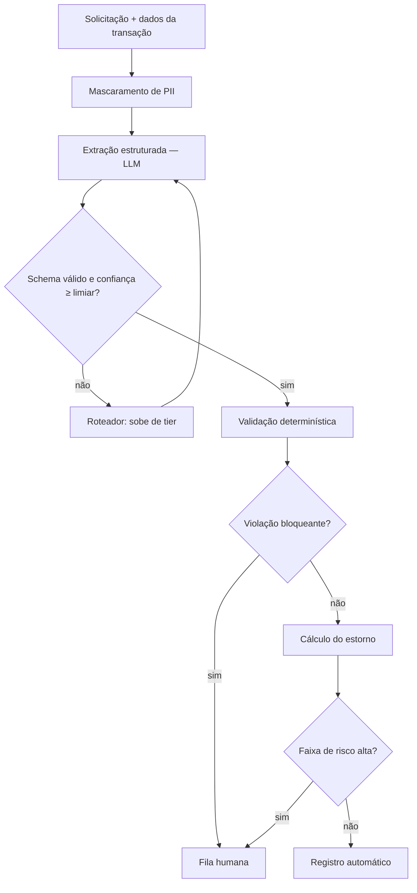

# voided - automação de triagem de contestação de transação

Pipeline agêntico para o processo de contestação (chargeback) de transações de cartão:
coleta da solicitação, validação de elegibilidade, cálculo do estorno e registro do caso.

> Desafio técnico. Os dados são sintéticos; nenhuma API externa é obrigatória para executar.

## Como rodar

```bash
mamba env create -f environment.yml
mamba activate voided
python run.py --mock --limit 100    # execução completa, sem chave de API
pytest -q                           # testes das regras e do cálculo
jupyter lab notebooks/analise.ipynb # métricas e decisões
```

O modo `--mock` reproduz respostas gravadas de uma execução real (`data/llm_cache.jsonl`),
então os números do notebook são reproduzíveis bit a bit.

---

## 0. Premissa: onde o LLM entra e onde não entra

<!-- TODO: 1 parágrafo. A tese do documento inteiro. Algo como: das quatro etapas,
     só uma é ambiguidade linguística. Prazo de contestação é `if`, valor de estorno é
     aritmética. Modelo de linguagem para tarefa determinística troca uma regra auditável
     por uma amostra de distribuição. -->

| Etapa | Natureza | Implementação |
|---|---|---|
| Coleta | I/O + texto livre | API interna + LLM para extração |
| Validação | regra de negócio | Python determinístico |
| Cálculo | aritmética | Python determinístico |
| Registro | I/O + redação | template + LLM só na resposta ao cliente |

## 1. Fluxo do agente

<!-- TODO: diagrama (mermaid) + descrição das transições.
     Pontos a cobrir explicitamente:
     - orquestrador é máquina de estados, não agente em loop livre
     - contrato Pydantic em toda fronteira (src/schemas.py)
     - três saídas possíveis: automático, escalado p/ modelo, escalado p/ humano
     - idempotência: reprocessar o mesmo id_caso não gera estorno duplicado -->



### Integração com ferramentas/APIs
<!-- TODO: listar as 3-4 integrações, todas atrás de interface (adapter), todas mockáveis.
     API de transações, sistema de casos, base de histórico do cliente, notificação.
     Dizer que nenhuma ferramenta é exposta ao LLM como tool call livre: quem chama é o
     orquestrador, com argumentos já validados. -->

## 2. Uso de modelos: quando SLM, quando escalar

<!-- TODO: tabela por tarefa. Critério para ficar no pequeno:
     saída fechada, schema rígido, alto volume, latência importa, dado sensível
     (roda dentro do perímetro).
     Critério para escalar: linguagem ambígua/narrativa longa, conflito entre relato e dados,
     categoria rara, valor alto. -->

| Tarefa | Tier padrão | Escala quando |
|---|---|---|
| Extração de campos | pequeno (aberto, self-hosted) | schema falha ou confiança < limiar |
| Classificação do motivo | pequeno | motivo = `indeterminado` |
| Reconciliação relato × transações | médio | divergência não resolvida |
| Redação da resposta ao cliente | pequeno + template | caso sensível/ouvidoria |

**Restrição de perímetro:** o caminho de alto volume roda modelo aberto hospedado
internamente. Só casos escalados, já com PII mascarada, alcançam API externa.
<!-- TODO: 2 frases sobre LGPD e mapa de reversão fora do pipeline. -->

## 3. Estratégia de roteamento

<!-- TODO: descrever a política (src/router.py) em 1 parágrafo + tabela de custo.
     Preços por milhão de tokens, com a DATA da consulta ao lado — isso muda todo mês.
     Mencionar cache de prompt (~90% off na entrada repetida) e batch (50%): mexem mais
     no custo do que trocar de modelo.
     Ponto forte: o limiar de confiança só é defensável se a confiança for CALIBRADA.
     Ver diagrama de confiabilidade e Brier score no notebook. -->

| Tier | Modelo | US$/M entrada | US$/M saída | % do volume | Custo/caso |
|---|---|---|---|---|---|
| pequeno | | | | | |
| médio | | | | | |
| grande | | | | | |

<!-- TODO: preencher com os números da sua execução de 100 casos. -->

## 4. Preparação de dados para fine-tuning

<!-- TODO: a resposta é "ainda não, e eis o caminho".
     - fase 1: prompt versionado + few-shot + saída estruturada, coletando log
     - o dataset nasce do log: casos escalados e corrigidos por humano são pares rotulados
     - destilação do tier grande → pequeno na etapa de extração
     - holdout TEMPORAL, não aleatório (vazamento)
     - deduplicação, estratificação por categoria rara, balanceamento
     - PII mascarada antes do treino; dataset versionado e imutável
     - critério de aceite: tem que bater o baseline com prompt no conjunto dourado -->

## 5. Métricas

<!-- TODO: separar em três blocos e dizer qual é a métrica que realmente importa. -->

**Qualidade**
- Concordância com o analista humano, por etapa (não só agregada)
- **Taxa de falso automatizado**: passou sem revisão e estava errado ← a métrica de risco
- Calibração da confiança (Brier score, diagrama de confiabilidade)

**Operação**
- Taxa de automação (% fechado sem humano)
- Taxa de escalada, por motivo
- Latência p50/p95

**Custo**
- Custo por execução, quebrado por tier
- Custo por caso automatizado com sucesso (o denominador honesto)

## 6. Validação contra o processo manual

<!-- TODO: o desenho experimental. Cobrir:
     - conjunto dourado a partir de casos históricos já decididos, estratificado
       para incluir os raros, não só os fáceis
     - shadow mode: roda em paralelo sem efeito; mede concordância
     - intervalo de confiança na taxa de acerto (n=50 não dá ±1%)
     - liberação por faixa: automatiza só a faixa de alta confiança, resto segue manual
     - critério de parada/rollback definido ANTES -->

## 7. Consistência e confiabilidade

<!-- TODO: temperatura 0 + saída estruturada; versionamento de prompt e modelo no log;
     idempotência por id_caso; retry com backoff e teto; circuit breaker se a taxa de
     falha de schema subir; nenhuma decisão com efeito financeiro sem validação
     determinística; trilha de auditoria completa (quem/quando/qual versão). -->

## 8. Limitações e próximos passos

<!-- TODO: honestidade explícita. Dados sintéticos, sem volume real, sem integração
     com sistema legado, calibração medida em n pequeno. O que eu faria com 2 semanas. -->

## Estrutura do repositório

```
src/schemas.py       contratos de todas as etapas
src/steps/           uma etapa por módulo, testável isoladamente
src/router.py        política de roteamento entre tiers
src/telemetry.py     escreve o JSONL de execução
src/orchestrator.py  máquina de estados
run.py               CLI
notebooks/analise.ipynb
```
